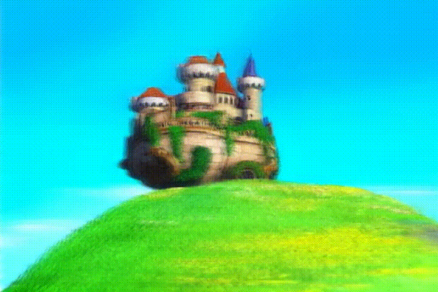

# Text2World
### Information
基于 3D GS和 video 生成技术构建的 Text2world pipeline。

### Example
|  参考示例  | 参考示例      |  参考示例   | 
|-----------|-----------|-----------|
| | | |
| | | |
### Dataset
数据来源：
* [RealEstate10K](https://google.github.io/realestate10k/download.html)
* [DL3DV](https://dl3dv-10k.github.io/DL3DV-10K/)
* [AC3D](https://infinite-nature.github.io/)

数据处理方法，请参考
1. 位姿数据预处理： [pixelsplat](https://github.com/dcharatan/pixelsplat)
2. caption: [VideoX-Fun](https://github.com/aigc-apps/VideoX-Fun) 或者[CameraCtrl](https://github.com/hehao13/CameraCtrl).
### inference
考虑到diffusion latent与后处理视频重新 encoder的 VAE latent存在一定的差异。

现提供两种推理 pipeline。
* `nonmap_pipeline.py` 对 diffusion 模型生成 video 进行后处理后作为输入提供给 latentLRM模型进行推理生成渲染视频。
* `remap_pipeline.py` 对diffusion生成的 latent的进行 remap 从而缓解这种差异。

对应的调用代码：
- $pose_folder: 类似 RE10K 的 pose folder
- $prompt_txt: prompt列表
- $MODEL_PATH： 视频生成模型参数
- $ckpt_path： controlnet模型参数
- $lrm_weight：LRM 模型参数
- $remap_weight（可选）： remap 模型参数
- $out_dir: 输出路径

```
python generate_nonmap_api.py \
    --prompt  $prompt_txt \ 
    --lrm_weight $lrm_weight \
    --pose_folder  \
    --base_model_path $MODEL_PATH \
    --controlnet_model_path $ckpt_path \
    --output_path $out_dir \
    --start_camera_idx 0 \
    --end_camera_idx 7 \
    --stride_min 2 \
    --stride_max 2 \
    --height 480 \
    --width 720 \
    --controlnet_weights 1.0 \
    --controlnet_guidance_start 0.0 \
    --controlnet_guidance_end 0.4 \
    --controlnet_transformer_num_attn_heads 4 \
    --controlnet_transformer_attention_head_dim 64 \
    --controlnet_transformer_out_proj_dim_factor 64 \
    --num_inference_steps 20
```

```
python generate_remap_api.py \
    --prompt  $prompt_txt \ 
    --pose_folder $pose_folder \
    --lrm_weight $lrm_weight \
    --remap_weight $remap_weight \
    --base_model_path $MODEL_PATH \
    --controlnet_model_path $ckpt_path \
    --output_path $out_dir \
    --start_camera_idx 0 \
    --end_camera_idx 7 \
    --stride_min 2 \
    --stride_max 2 \
    --height 480 \
    --width 720 \
    --controlnet_weights 1.0 \
    --controlnet_guidance_start 0.0 \
    --controlnet_guidance_end 0.4 \
    --controlnet_transformer_num_attn_heads 4 \
    --controlnet_transformer_attention_head_dim 64 \
    --controlnet_transformer_out_proj_dim_factor 64 \
    --num_inference_steps 20
```

### Training 
参考`wonderland`, 将 latentLRM 模型和 video diffusion 模型分开训练。方法见次级子目录