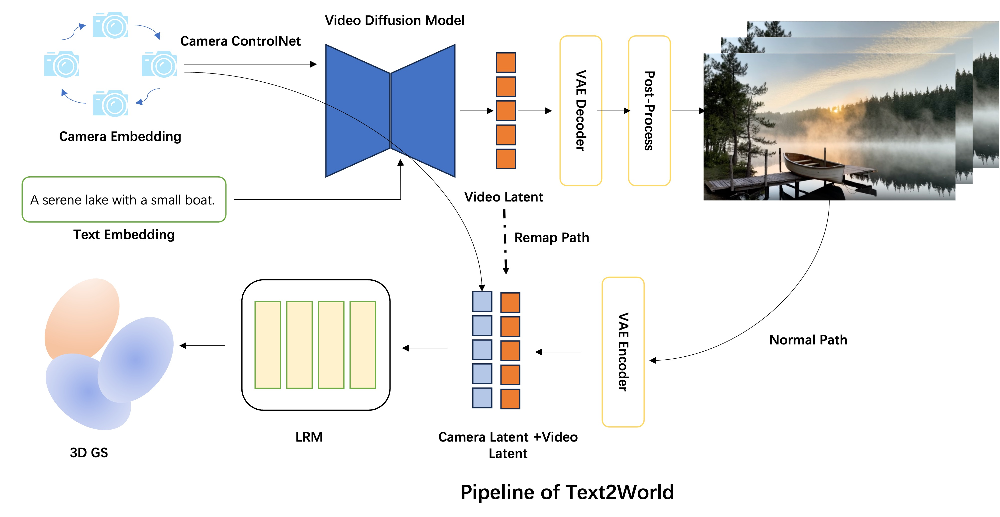

# Text2World

### Information
A Text2World pipeline based on 3D Gaussian Splatting and video generation technology.

Features:
1. The first open-source pipeline combining T2V models with Mamba-Transformer architecture LRM
2. More efficient LRM reconstruction model: Composed of a video VAE encoder and Mamba-Transformer structure, enabling the LRM model to process more images while consuming less GPU memory
3. Provides two pathways for 3DGS construction:
   - **Normal Path**: Decodes latents and post-processes the video, then re-encodes to generate video latents
   - **Remap Path (Experimental)**: Directly maps video latents to decoder-generated latents using a remap model, eliminating unnecessary decoder-encoder and post-processing steps, preparing for future end-to-end training

### BENCHMARK
To validate the pipeline's effectiveness and LRM model performance, we created evaluation datasets:
- **Public dataset**: Evaluates LRM's reconstruction performance in real-world scenarios
- **Synthetic dataset**: Evaluates LRM's reconstruction in generated scenes. We used LLM to generate 1,000 scene prompts covering:
  - Natural Landscapes (200 prompts)
  - Urban Environments (150 prompts)
  - Interiors (150 prompts)
  - Fantasy Settings (150 prompts)
  - Sci-Fi Settings (150 prompts)
  - Historical Settings (100 prompts)
  - Abstract Compositions (100 prompts)
  
Random camera parameters from RE10K dataset were used as input.

| Dataset    | PSNR  | SSIM | LPIPS |
|------------|-------|------|-------|
| Public     | 29.34 | 0.87 | 0.205 |
| Synthetic  |       |      |       |

### Example
| Example 1 | Example 2 | Example 3 |
|-----------|-----------|-----------|
|  |  |  |
|  |  |  |

### Dataset
Data sources:
* [RealEstate10K](https://google.github.io/realestate10k/download.html)
* [DL3DV](https://dl3dv-10k.github.io/DL3DV-10K/)
* [AC3D](https://infinite-nature.github.io/)

Data processing methods:
1. Pose data preprocessing: [pixelsplat](https://github.com/dcharatan/pixelsplat)
2. Caption generation: [VideoX-Fun](https://github.com/aigc-apps/VideoX-Fun) or [CameraCtrl](https://github.com/hehao13/CameraCtrl)

### Inference
Considering the differences between diffusion latents and re-encoded VAE latents from post-processed videos, we provide two inference pipelines:

* `nonmap_pipeline.py`: Processes diffusion-generated videos through post-processing before feeding to latentLRM for rendering
* `remap_pipeline.py`: Remaps diffusion-generated latents to reduce discrepancies

Usage:


- `nonmap_pipeline.py`: Takes the post-processed video generated by the diffusion model as input and feeds it to the latentLRM model for rendering.  (Recommendation!!!)
- `remap_pipeline.py`: Performs latent remapping on the diffusion-generated latent to mitigate these differences.  

### Command-Line Arguments  
- `$pose_folder`: Pose folder similar to RE10K  
- `$prompt_txt`: List of prompts  
- `$MODEL_PATH`: Video generation model parameters  
- `$ckpt_path`: ControlNet model parameters  
- `$lrm_weight`: LRM model parameters  
- `$remap_weight` (optional): Remap model parameters  
- `$out_dir`: Output directory  

#### Non-Mapping Pipeline  
```bash
python generate_nonmap_api.py \  
    --prompt $prompt_txt \   
    --lrm_weight $lrm_weight \  
    --pose_folder \  
    --base_model_path $MODEL_PATH \  
    --controlnet_model_path $ckpt_path \  
    --output_path $out_dir \  
    --start_camera_idx 0 \  
    --end_camera_idx 7 \  
    --stride_min 2 \  
    --stride_max 2 \  
    --height 480 \  
    --width 720 \  
    --controlnet_weights 1.0 \  
    --controlnet_guidance_start 0.0 \  
    --controlnet_guidance_end 0.4 \  
    --controlnet_transformer_num_attn_heads 4 \  
    --controlnet_transformer_attention_head_dim 64 \  
    --controlnet_transformer_out_proj_dim_factor 64 \  
    --num_inference_steps 20
```